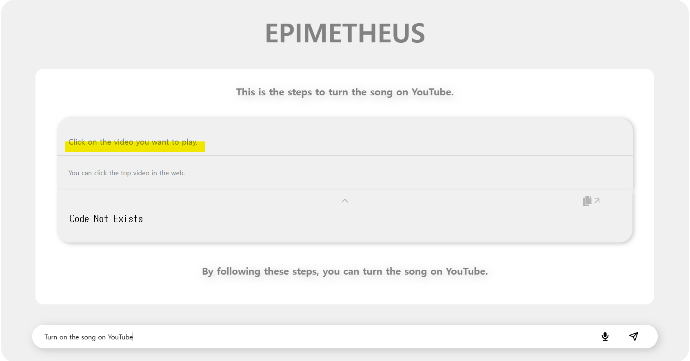
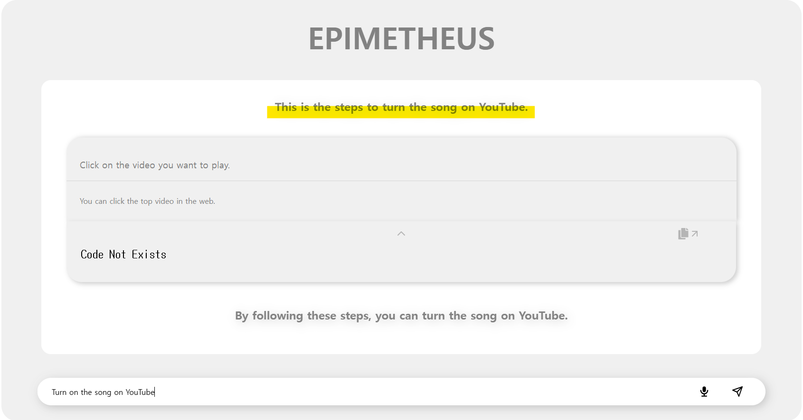
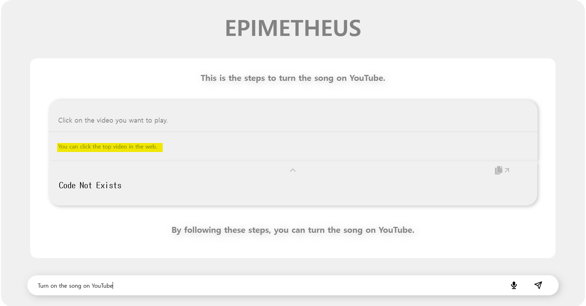
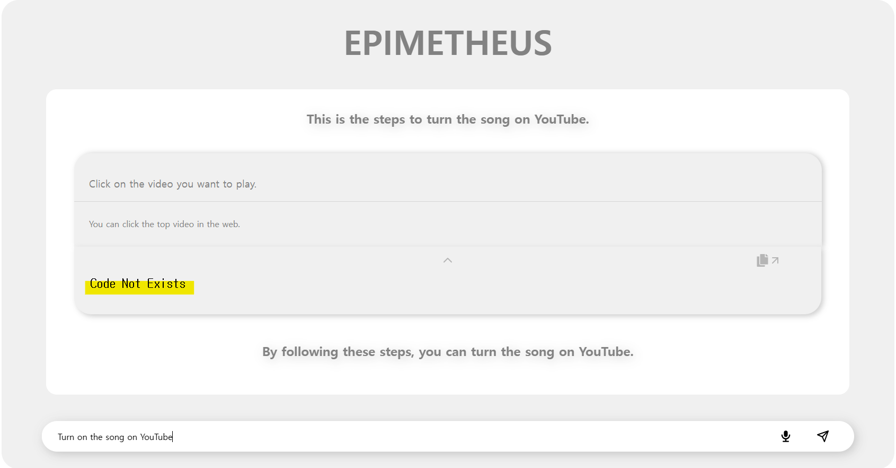
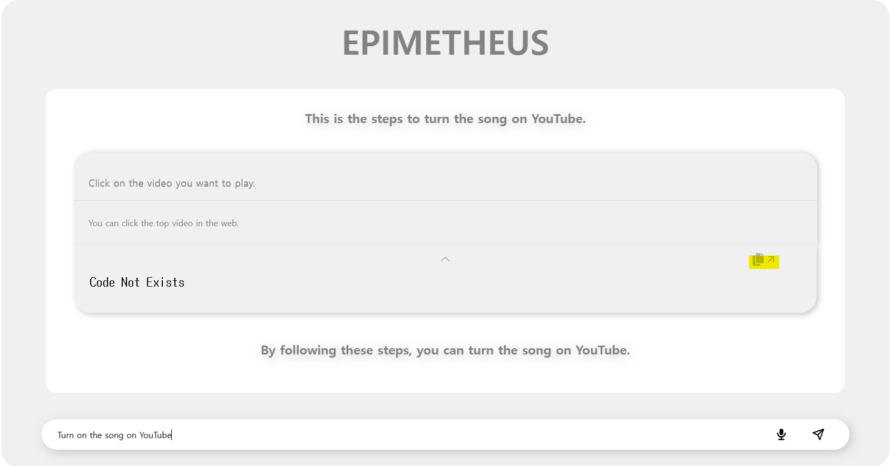
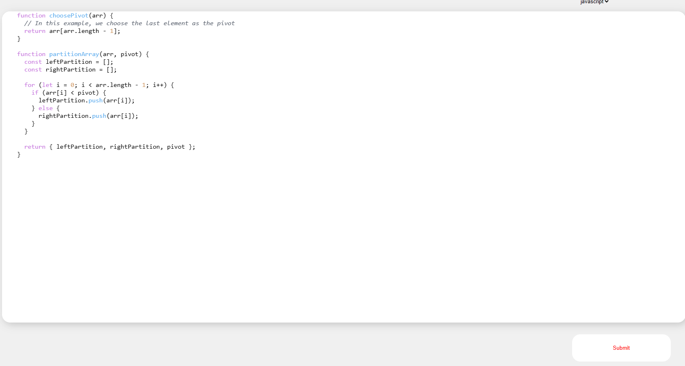
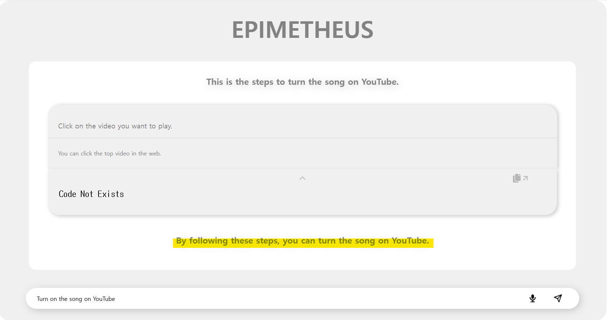
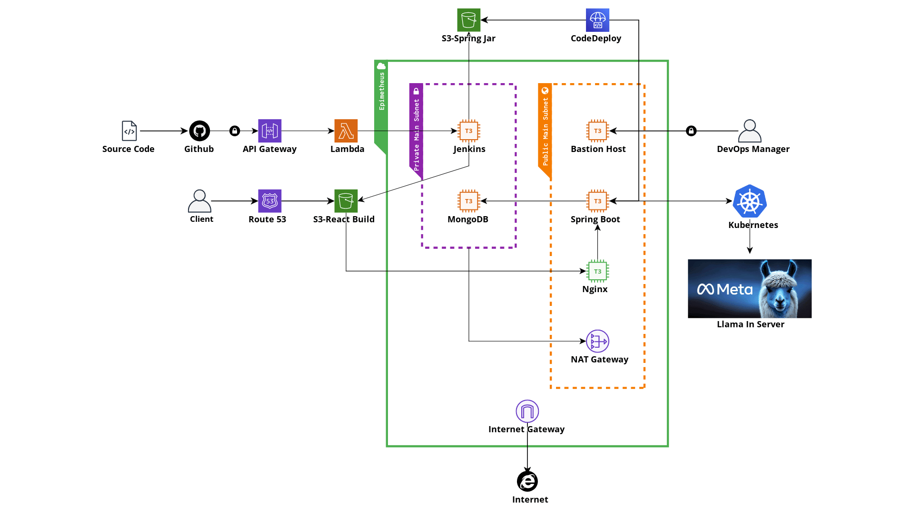

 
 
 <a href="http://www.epimetheus.store">Try It Out!</a>

 
# EPIMETHEUS

> 목표 달성을 위한 과정을 생성하고 실현하는 자동화된 AI 플랫폼, EPIMETHEUS입니다.  
> An automated AI platform that actualizes user goals, innovatively generating and executing processes for goal achievement using LLMs.

이 프로젝트는 사용자가 제공한 목표를 실제로 실행할 수 있는 자동화 AI 플랫폼 구현이 주된 목표입니다. 대형 언어 모델(LLMs)이 일련의 과정을 생성 후 제공함으로써 사용자는 목표를 이루기 위한 단계를 알 수 있습니다. 

This project's primary goal is the implementation of an automated AI platform that can actually execute goals provided by users. Large Language Models (LLMs) generate and provide a series of steps, allowing users to understand the stages necessary to achieve their goals.

AI 모델의 단점인 블랙박스 특성을 없애기 위해, 목표를 달성하기 위한 각 단계의 적절한 코드를 저장소에서 가져오고, 실행한다는 점에서 기존의 서비스와는 다른 방향을 택하고 있습니다. 사용자가 직접 커스터마이징을 하여 실행할 수도 있습니다.

In order to eliminate the black box characteristic, which is a drawback of AI models, this service takes a different approach from existing services by retrieving and executing appropriate codes for each step to achieve the goals from a repository. Users can also customize and execute these steps themselves.

## 핵심 기능(Core Features)
사용자가 요청한 Task에 대해서 응답을 제공합니다. 응답은 1개 이상의 Step으로 구성됩니다. 
It provides responses to the Tasks requested by the user. The response consists of one or more Steps.

> 각 Step에는 예시 코드가 함께 제공됩니다. 예시 코드를 사용자가 적절하게 수정한다면 원하는 Task가 실행될 것입니다. 
> Each Step comes with example code. If the user appropriately modifies the example code, the desired Task will be executed.

음성인식을 통한 Task 입력 기능이 제공됩니다. 
Task input functionality through voice recognition is provided.

> 현재는 영어 버전만 지원하고 있습니다. 
> Currently, only the English version is supported.

## 구성(Components)
목표를 입력하면 아래와 같이 화면이 구성됩니다. 
 When you enter a goal, the screen will be arranged as follows.

- [Introduction](#introduction)
- [Step(One or more)](#stepone-or-more)
- [Description](#description)
- [Code](#code)
- [코드 수정 페이지(Code Modification Page)](#코드-수정-페이지code-modification-page)
- [Conclusion](#conclusion)

<h3 id="intro">Introduction</h3>

<h3 id="steps">Step(One or more)</h3>

<h3 id="description">Description</h3>

<h3 id="code">Code</h3>

<h3 id="modify_cdode">코드 수정 페이지(Code Modification Page)</h3>

<h3 id="outro">Conclusion</h3>

> 본 페이지의 구성은 추후 변경될 수 있습니다. 
>The layout of this page is subject to change in the future.

## 내부 구조(Architecture)

**FastAPI**와 **Spring Boot** 서버로 구성되어 있습니다. 
The system is comprised of FastAPI and Spring Boot servers.
- `FastAPI 내부에는 Llama LLM이 탑재되어 있습니다.` Inside FastAPI, the Llama LLM is integrated.
- `Kubernetes를 통한 FastAPI 서버의 로드밸런싱이 지원됩니다.` Load balancing of the FastAPI server is supported through Kubernetes.
- `JAVA 17, Spring Boot 3.1.3을 기반으로 작성되었습니다.` It is written based on JAVA 17, Spring Boot 3.1.3.
- `Nginx를 통한 Reverse Proxy설정이 되어있습니다.` Reverse Proxy settings are configured through Nginx.

 

**MongoDB Storage**는 외부에서 접근할 수 없습니다. MongoDB Storage is not accessible from outside.
- `VPC내에서 Subnet을 분리하여 외부 접근을 차단했습니다.` MongoDB Storage is not accessible from outside.
- `주요 자산인 Code를 저장할 수 있습니다.` It can store key assets such as Code.

 

**Jenkins**를 통한 CI/CD Automation이 구축되어 있습니다. CI/CD Automation through Jenkins has been established.
- `Github Webhook을 이용하여 코드의 변경을 능동적으로 감지합니다.` Code changes are actively detected using GitHub Webhooks.
- `Jenkins는 일반 사용자가 접근할 수 없습니다.` Jenkins is not accessible to regular users.
- `Client Side App(React)는 S3에서 정적 호스팅됩니다.` The Client Side App (React) is statically hosted on S3.
- `Server Side API Server(SpringBoot)는 CodeDeploy를 통해 배포됩니다.` The Server Side API Server (SpringBoot) is deployed through CodeDeploy.

## 기술 스택(Tech)
    
